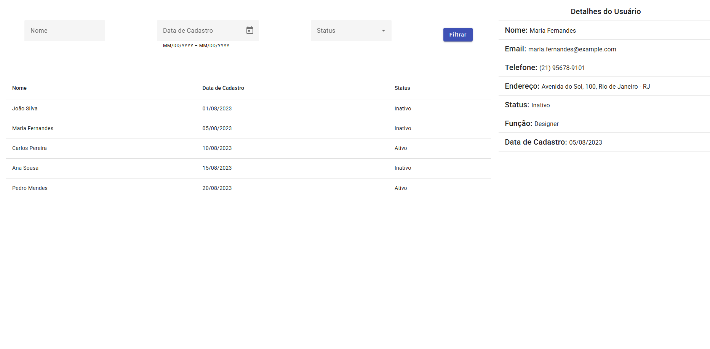
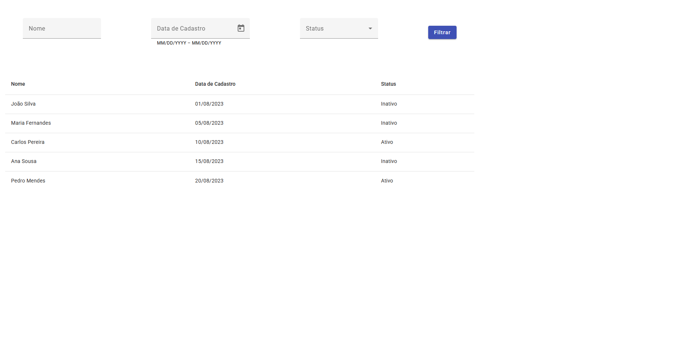
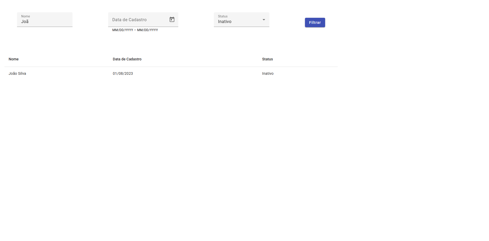

📋 Projeto Lista de Usuários - Angular

Este projeto foi desenvolvido com Angular como parte de um exercício acadêmico. A aplicação exibe uma lista de usuários e permite a filtragem por nome, data de cadastro e status. Além disso, ao clicar em um usuário, um painel lateral exibe detalhes sobre ele, mantendo tudo na mesma página, sem navegação ou roteamento.

🚀 Funcionalidades
Listagem de Usuários:
A aplicação exibe uma lista completa com nome, e-mail, telefone, endereço, status e data de cadastro dos usuários.

Filtros:
O usuário pode filtrar a lista de usuários por:

Nome (Pesquisa por nome)

Data de Cadastro (Intervalo de datas)

Status (Ativo/Inativo)

Detalhes do Usuário:
Ao clicar em um usuário, mais informações sobre ele são exibidas em um painel lateral na mesma tela, sem a necessidade de navegar para outra página.

🛠️ Tecnologias Utilizadas
Angular (Componentes, Diretivas, Pipes, Forms, Angular Material)

TypeScript (Lógica e Tipagem)

CSS (Estilização)

Angular Material (Para componentes de UI como formulários, botões e listas)

📷 Imagens do Projeto

 
   
 
  

    
  

  

    
  

